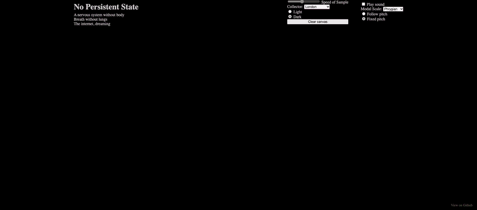

# No Persistent State

[](https://github.com/ruyzambrano/no-persistent-state/actions/workflows/test.yml)

A live visualisation of BGP routing updates from RIPE NCC's [RIS Live](https://ris-live.ripe.net/) feed. Each route announcement is drawn as a stroke on a canvas and then fades to a faint ghost. No data is stored or replayed.

**Live:** https://ruyzambrano.github.io/no-persistent-state/



## Running locally

There's no build step and there are no dependencies. The JavaScript uses ES modules, which browsers won't load from `file://`, so serve the folder with any static file server and open http://localhost:8000:

```
python -m http.server
```

## Tests

The pure logic (hashing, curve geometry, sound mapping, stroke timing and the RIS Live subscription handling) is unit tested with Node's built-in test runner, so there's nothing to install. Requires Node 22 or later.

```
npm test
```

Tests run on every push and pull request via GitHub Actions, on Node 22 and 24.

## Stack

- Vanilla HTML, CSS and JavaScript
- Canvas 2D for drawing
- Web Audio API for sound
- WebSocket connection to RIS Live

## Controls

| Control | Effect |
|---|---|
| Collector | Which RIS route collector to listen to (default London) |
| Speed of sample | How often a new stroke starts, from every 2s (left) to every 20ms (right) |
| Light / Dark | Page background colour |
| Clear canvas | Wipes the canvas and stops any strokes still drawing |
| Full Screen (or press F) | Hides the controls and goes fullscreen. Press F or Esc to exit |
| Play sound | Turns audio on or off |
| Modal scale | Musical scale that pitches are snapped to (default Phrygian) |
| Follow pitch / Fixed pitch | Whether a stroke's pitch changes as it draws or stays on its starting note |

## How it works

### Data

The page subscribes to one RIS Live collector at a time over `wss://ris-live.ripe.net/v1/ws/`. The default is `rrc01` (London). The collector picker offers one per region:

| Option | Collector | Type |
|---|---|---|
| London | `rrc01` | IXP (LINX, LONAP) |
| Paris | `rrc21` | IXP (France-IX) |
| New York | `rrc11` | IXP (NYIIX) |
| São Paulo | `rrc15` | IXP (IX.br) |
| Johannesburg | `rrc19` | IXP (NAP Africa) |
| Dubai | `rrc26` | IXP (UAE-IX) |
| Tokyo | `rrc06` | IXP (DIX-IE, JPIX) |
| Singapore | `rrc23` | IXP (Equinix) |
| Global | `rrc00` | Multihop, peers worldwide |

Switching collector unsubscribes and resubscribes on the same socket, and clears the buffer so strokes from the old collector don't carry over. The full list of collectors is in the [RIS docs](https://ris.ripe.net/docs/route-collectors/).

Incoming `ris_message` events go into a buffer capped at the 500 most recent. On each tick, the newest message is taken and its AS path is drawn, as long as the path has more than two hops. If the connection drops, it reconnects with exponential backoff (1s doubling up to 30s).

### Colour and position

Each AS number is hashed to a fixed hue and a fixed canvas position, so the same network always gets the same colour and, for a given window size, the same position. Positions are worked out as a remainder of the canvas width and height, so resizing the window moves every network to a new spot. The hash function runs three times with different salts to get hue, x and y, which stops the three values correlating with each other.

- **Hue** comes from the last ASN in the path (the origin network).
- **Points** along the stroke are the positions of each ASN in the path.
- **Line width** scales with path length.

### Strokes

Strokes are drawn as a chain of quadratic Bezier curves. Each hop is a control point, and each segment runs between the midpoints of neighbouring hops, so the joins stay smooth. The first and last segments start and end on the actual first and last points. Strokes animate in a little at a time, one segment after another.

### Fading

The canvas is never cleared. Every frame it draws a near-transparent rectangle using `destination-out` compositing, which lowers the alpha of existing pixels. Because the canvas stores alpha as whole numbers, the fade stalls at about 25% opacity, so old strokes leave a faint ghost that builds up over time. That's kept on purpose. The fade works the same on either background, and Clear canvas wipes the ghosts.

The canvas is sized to the window and scaled by `devicePixelRatio`, so lines stay sharp on high-resolution screens. Resizing the window keeps the drawing and stretches it to the new size. A snapshot is taken at the start of a resize and reused until the window has been still for 250ms, so dragging the window edge doesn't blur the image through repeated rescaling.

### Sound

Sound is off by default; browsers require a click before audio can play. When it's on, each stroke gets its own oscillator:

| Parameter | Source | Mapping |
|---|---|---|
| Pitch | y-position | ±2 octaves around A440, snapped to the nearest note in the selected scale |
| Pan | x-position | Linear, left to right |
| Waveform | Hue | Sine, triangle, square or sawtooth by hue range |
| Gain | Path length | 0.02 to 0.15, kept low because overlapping strokes add up |

Strokes that start while sound is off stay silent; nothing is queued.

### Reduced motion

If the operating system's "reduce motion" setting is on, new strokes start four times less often and draw at half speed. The page picks up a change to the setting without a reload.

### Full screen

Full Screen hides the controls and the cursor and requests fullscreen. If the browser refuses fullscreen (some mobile browsers do), the controls are still hidden. Leaving fullscreen by any route brings the controls back. The canvas grows to fill the space the controls used, so networks move to new positions, as with any resize.

## Repo contents

```
index.html, styles.css    page and layout
preview.gif, preview.png  README animation and link-preview image
package.json              npm test script (no dependencies)
src/
  main.js                 wires up the controls, buffer and animation loop
  stream.js               RIS Live connection, subscriptions and reconnects
  canvas.js               canvas sizing, high-DPI scaling and resize handling
  display-mode.js         fullscreen with controls hidden
  pacing.js               stroke timing, including reduced motion
  hash.js                 ASN to colour and position
  geometry.js             Bezier curve segments
  sound.js                position, colour and path length to pitch, pan, waveform and gain
test/                     unit tests for the modules above
.github/workflows/        CI
```

- `subscribe.py`, `stream.ipynb`, `requirements.txt`: Python scripts I used to explore the RIS Live feed before building the site. The site doesn't need them.

## Credit

Routing data comes from [RIPE NCC RIS Live](https://ris-live.ripe.net/), a free public BGP monitoring service.

## Licence

MIT. See [LICENSE](LICENSE).
